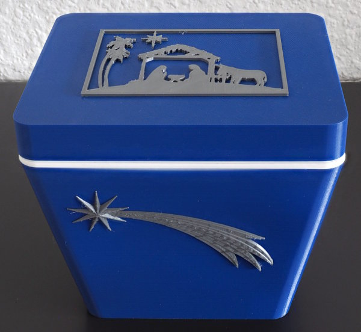
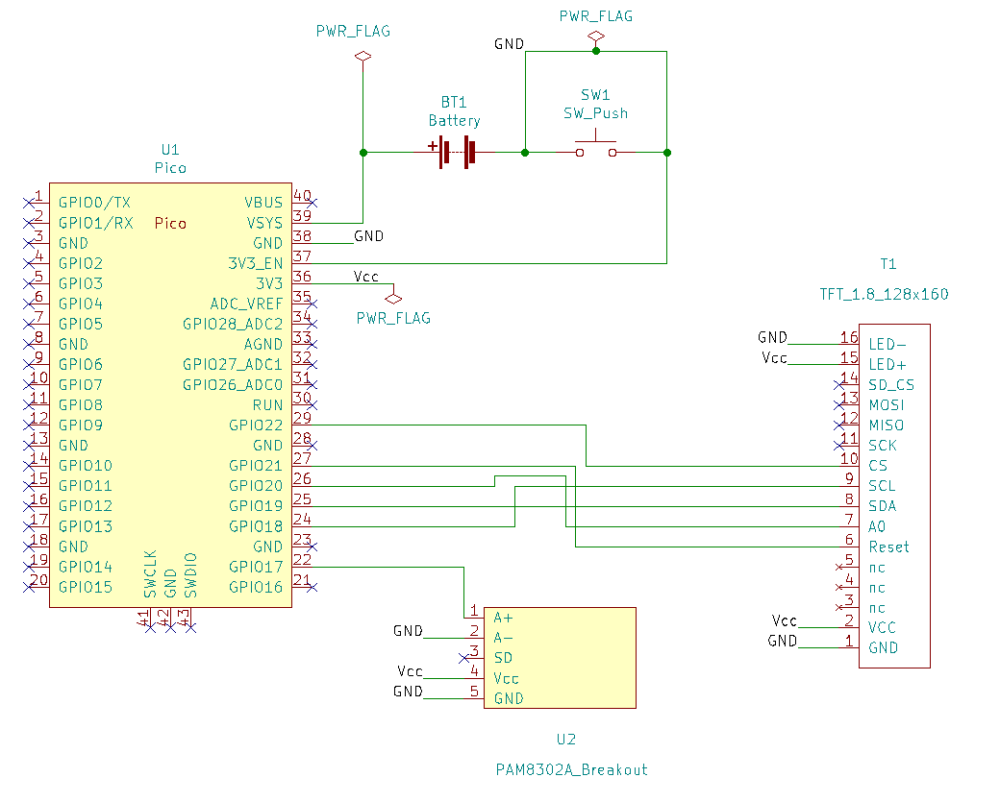
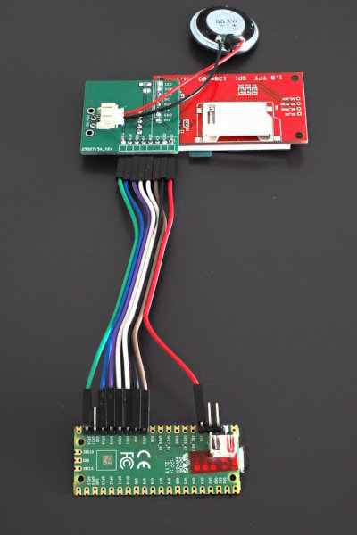
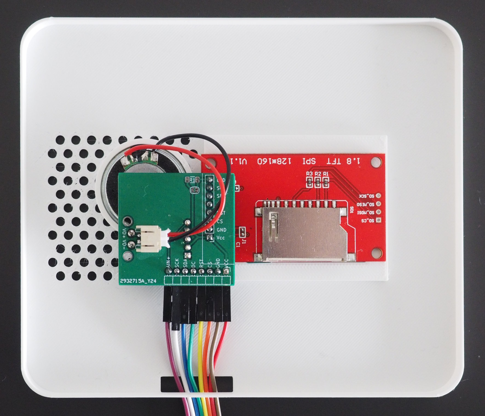

A Christmas-box with sound and display
======================================

This project is about a Christmas-box, that plays a song and
displays images when the lid is opened:

Electronics
-----------

The basis for the electronics is a Raspberry Pi Pico, together
with a small 1.8"-TFT-display and a PAM802A amplifier. The TFT
and the speaker are in the lid, whereas the Pico is inside of
the box.

(The PAM802A is below the green support PCB).

Software
--------

The Pico runs a small CircuitPython-script that has everything
necessary to display files and to play MP3. The source-code
is in `src/`, some sample media-files are in `src/media/`.

Images must be in BMP-format and the MP3-files are downsampled,
because the Pico does not have enough power to play files with
higher sample-rate.

Build
-----

The box itself was designed using OpenSCAD (source-code in `3D/`).
There is an outer-shell and a smaller inner-shell to make room
for the battery and the Pico:

The lid consists also of two parts:
the outer-part and a frame for the TFT and the speaker.

More images are in the `build/`-directory.

OpenSCAD allows parameters for all dimensions, so you can adjust
the sizes of the parts to your needs without any problems.
Note that I print with tight tolerances, depending on your printer,
you must change this.
